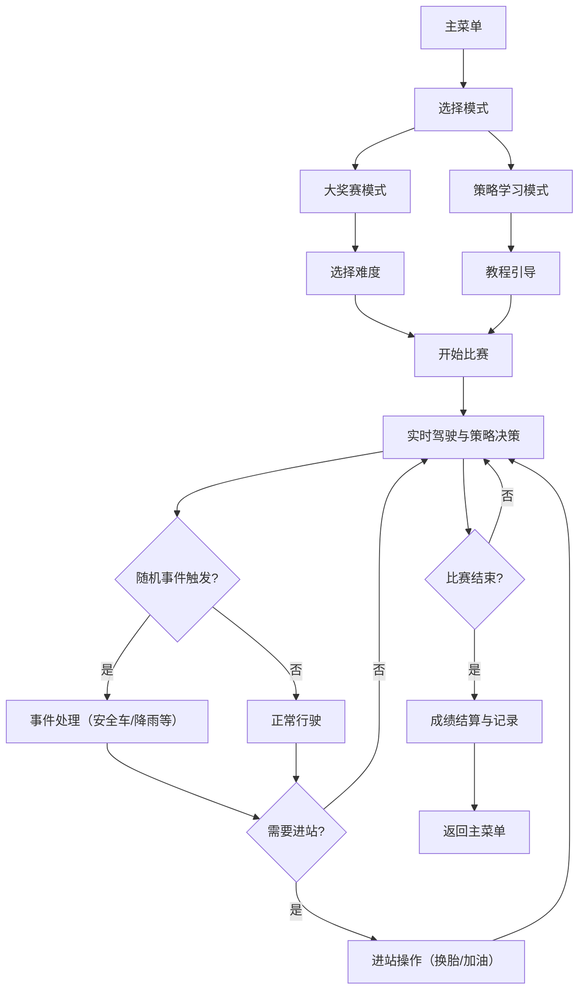

## 1. 产品概述

F1赛车进站策略与轮胎管理挑战是一款基于Phaser.js + TypeScript开发的赛车策略模拟游戏。玩家扮演F1车队策略师，在大奖赛中根据赛道特性、天气变化和竞争对手动态，制定进站时机、轮胎配方选择和燃油负载策略，以最优策略赢得比赛。

- 核心玩法：管理轮胎磨损、燃油消耗，应对随机事件，击败AI对手
- 目标用户：赛车策略爱好者、模拟经营游戏玩家
- 市场价值：填补F1策略类网页游戏空白，提供沉浸式策略决策体验

## 2. 核心功能

### 2.1 用户角色

| 角色 | 注册方式 | 核心权限 |
|------|----------|----------|
| 玩家 | 无需注册，本地存储 | 进行游戏、调整策略、查看最高分记录 |

### 2.2 功能模块

1. **主菜单页面**：游戏开始、难度选择、模式选择、最高分查看
2. **比赛场景页面**：赛道可视化、赛车动画、实时HUD信息、策略控制面板
3. **策略学习模式**：教程指导、最佳策略演示、决策反馈
4. **结果页面**：比赛成绩、详细统计、历史记录

### 2.3 页面详情

| 页面名称 | 模块名称 | 功能描述 |
|---------|----------|----------|
| 主菜单 | 导航区 | 开始游戏、大奖赛模式、策略学习、最高分 |
| 主菜单 | 难度选择 | 简单/一般/困难三档，影响AI强度和事件频率 |
| 比赛场景 | 赛道地图 | 2D俯视角赛道，显示赛车位置、进站区、弯角 |
| 比赛场景 | 实时HUD | 圈数、排名、轮胎磨损、燃油余量、天气状态 |
| 比赛场景 | 策略面板 | 轮胎选择（软/硬/雨胎）、进站时机控制、燃油调整 |
| 比赛场景 | 事件系统 | 安全车、突发降雨、对手undercut、爆胎风险 |
| 策略学习 | 教程模块 | 逐步引导玩家理解各项机制 |
| 策略学习 | 反馈系统 | 决策质量评估、改进建议 |
| 结果页面 | 成绩统计 | 完赛时间、进站次数、轮胎使用分析 |
| 结果页面 | 本地记录 | 最高分、最佳圈速、历史成绩榜单 |

## 3. 核心流程

玩家从主菜单选择游戏模式和难度，进入比赛场景。比赛开始后，赛车在赛道上行驶，玩家需要实时监控轮胎磨损和燃油状态，在适当时机呼叫进站更换轮胎和补充燃油。过程中需要应对天气变化、安全车出动等随机事件，同时观察对手策略做出应对。比赛结束后显示成绩并更新本地记录。

## 4. 用户界面设计

### 4.1 设计风格

- 主色调：赛车红（#DC2626）+ 碳纤维深灰（#1F2937）+ 金属银（#D1D5DB）
- 辅助色：轮胎配方色（软胎红#EF4444、硬胎白#F9FAFB、雨胎蓝#3B82F6）
- 整体风格：现代科技感、F1赛事风格、仪表盘式UI
- 按钮风格：圆角矩形、金属质感边框、悬停发光效果
- 字体：显示屏字体（Orbitron）+ 无衬线字体（Rajdhani）
- 布局：顶部信息栏 + 中央游戏区域 + 底部策略面板
- 图标：赛车仪表盘风格，使用线条图标配合状态指示灯

### 4.2 页面设计概述

| 页面名称 | 模块名称 | UI元素 |
|---------|----------|--------|
| 主菜单 | 标题区 | 大字体游戏标题、F1风格徽章、粒子动画背景 |
| 主菜单 | 菜单选项 | 垂直排列的霓虹风格按钮，选中时发光 |
| 比赛场景 | 赛道视图 | 深色沥青赛道、路肩红白条、草地纹理、进站区标记 |
| 比赛场景 | 赛车渲染 | 俯视视角赛车、轮胎配色标识、尾迹效果 |
| 比赛场景 | HUD面板 | 半透明玻璃态设计、实时数据数字显示、进度条动画 |
| 比赛场景 | 策略面板 | 轮胎选择按钮组、进站倒计时滑块、燃油负载指示器 |
| 策略学习 | 教程面板 | 半透明遮罩、高亮引导框、分步说明文字 |
| 结果页面 | 成绩榜单 | 表格布局、排名奖牌、数据可视化图表 |

### 4.3 响应性

- 桌面端优先设计，最小支持1280x720分辨率
- 自适应不同屏幕尺寸，使用CSS Grid和Flex布局
- 游戏画布保持16:9比例，居中显示
- 策略面板支持触摸操作，按钮最小尺寸44px

### 4.4 游戏视觉效果

- 赛道环境：沥青颗粒纹理、路肩红白条纹、缓冲区沙地纹理
- 赛车动画：行驶时轻微震动、进站点火特效、轮胎锁死烟雾
- 天气效果：降雨粒子、湿地反光、干地热霾效果
- UI动效：数字滚动动画、进度条平滑过渡、事件警报闪烁
- 摄像机：跟随玩家赛车，进站时平滑缩放聚焦
