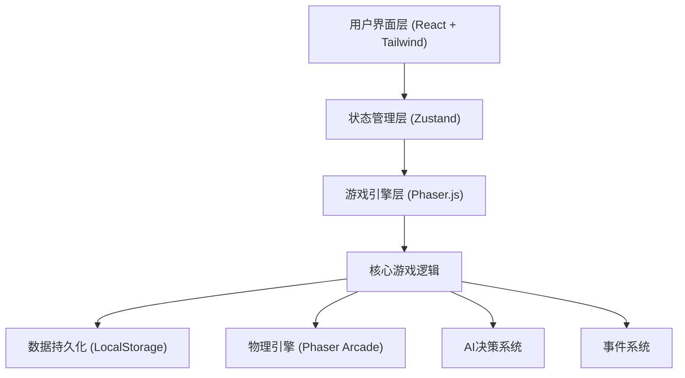

## 1. 架构设计

本项目采用前端纯客户端架构，使用Phaser.js作为游戏引擎，React负责UI层渲染，Zustand进行状态管理，数据持久化通过浏览器LocalStorage实现。



## 2. 技术描述

- **前端框架**：React 18 + TypeScript + Vite
- **游戏引擎**：Phaser.js 3.80+
- **状态管理**：Zustand
- **样式方案**：TailwindCSS 3
- **开发工具**：Vite 5
- **数据存储**：LocalStorage（本地最高分记录）
- **构建工具**：Vite，端口配置为55001

## 3. 项目目录结构

```
src/
├── game/                    # Phaser游戏核心
│   ├── scenes/              # 游戏场景
│   │   ├── BootScene.ts     # 资源加载场景
│   │   ├── RaceScene.ts     # 比赛主场景
│   │   └── PauseScene.ts    # 暂停场景
│   ├── objects/             # 游戏对象
│   │   ├── Car.ts           # 赛车类
│   │   ├── Track.ts         # 赛道类
│   │   ├── Tire.ts          # 轮胎类
│   │   └── AIController.ts  # AI控制器
│   ├── systems/             # 游戏系统
│   │   ├── TireSystem.ts    # 轮胎管理系统
│   │   ├── FuelSystem.ts    # 燃油系统
│   │   ├── WeatherSystem.ts # 天气系统
│   │   ├── EventSystem.ts   # 事件系统
│   │   └── PitStopSystem.ts # 进站系统
│   └── config/              # 游戏配置
│       ├── trackData.ts     # 赛道数据
│       ├── difficulty.ts    # 难度配置
│       └── constants.ts     # 游戏常量
├── store/                   # Zustand状态管理
│   ├── useGameStore.ts      # 游戏状态
│   └── useUISTore.ts        # UI状态
├── types/                   # TypeScript类型定义
│   ├── game.ts              # 游戏类型
│   └── ui.ts                # UI类型
├── components/              # React组件
│   ├── MainMenu.tsx         # 主菜单
│   ├── HUD.tsx              # 游戏HUD
│   ├── StrategyPanel.tsx    # 策略面板
│   ├── Results.tsx          # 结果页面
│   ├── Tutorial.tsx         # 教程组件
│   └── HighScores.tsx       # 最高分榜单
├── utils/                   # 工具函数
│   ├── storage.ts           # 本地存储
│   └── helpers.ts           # 辅助函数
├── App.tsx                  # 应用入口
├── main.tsx                 # React入口
└── index.css                # 全局样式
```

## 4. 核心数据模型

### 4.1 TypeScript类型定义

```typescript
// 轮胎类型
type TireCompound = 'soft' | 'medium' | 'hard' | 'wet';

// 天气类型
type Weather = 'dry' | 'light_rain' | 'heavy_rain';

// 难度级别
type Difficulty = 'easy' | 'normal' | 'hard';

// 游戏模式
type GameMode = 'grand_prix' | 'learning';

// 比赛状态
type RaceState = 'countdown' | 'racing' | 'safety_car' | 'paused' | 'finished';

// 赛车状态
interface CarState {
  id: string;
  name: string;
  color: string;
  isPlayer: boolean;
  position: number;
  lap: number;
  totalTime: number;
  bestLapTime: number;
  currentLapTime: number;
  speed: number;
  fuel: number;
  tireCompound: TireCompound;
  tireWear: number;
  tireTemperature: number;
  inPit: boolean;
  pitStops: number;
}

// 比赛事件
interface RaceEvent {
  id: string;
  type: 'safety_car' | 'rain' | 'crash' | 'undercut';
  lap: number;
  duration: number;
  active: boolean;
  data?: Record<string, any>;
}

// 比赛配置
interface RaceConfig {
  trackId: string;
  totalLaps: number;
  difficulty: Difficulty;
  mode: GameMode;
  startingFuel: number;
  startingTire: TireCompound;
}

// 最高分记录
interface HighScore {
  id: string;
  trackName: string;
  mode: GameMode;
  difficulty: Difficulty;
  position: number;
  totalTime: number;
  bestLap: number;
  pitStops: number;
  date: string;
}
```

### 4.2 游戏常量配置

```typescript
// 轮胎特性配置
const TIRE_COMPOUNDS: Record<TireCompound, TireStats> = {
  soft: { grip: 1.05, wearRate: 2.5, optimalTemp: [80, 100], color: '#EF4444' },
  medium: { grip: 1.0, wearRate: 1.5, optimalTemp: [75, 95], color: '#FBBF24' },
  hard: { grip: 0.95, wearRate: 0.8, optimalTemp: [70, 90], color: '#F9FAFB' },
  wet: { grip: 1.1, wearRate: 3.0, optimalTemp: [40, 60], color: '#3B82F6' }
};

// 难度配置
const DIFFICULTY_CONFIG: Record<Difficulty, DifficultyConfig> = {
  easy: { aiSpeedMultiplier: 0.85, eventFrequency: 0.5, tireWearMultiplier: 0.7 },
  normal: { aiSpeedMultiplier: 0.95, eventFrequency: 1.0, tireWearMultiplier: 1.0 },
  hard: { aiSpeedMultiplier: 1.02, eventFrequency: 1.5, tireWearMultiplier: 1.3 }
};
```

## 5. 状态管理设计

### 5.1 Zustand Store结构

```typescript
// 游戏状态Store
interface GameState {
  // 比赛状态
  raceState: RaceState;
  currentLap: number;
  totalLaps: number;
  raceTime: number;
  
  // 赛车数据
  cars: CarState[];
  playerCarId: string;
  
  // 环境状态
  weather: Weather;
  safetyCarActive: boolean;
  
  // 事件系统
  activeEvents: RaceEvent[];
  
  // 配置
  config: RaceConfig | null;
  
  // Actions
  initRace: (config: RaceConfig) => void;
  updateCar: (carId: string, updates: Partial<CarState>) => void;
  callPitStop: (carId: string, nextTire: TireCompound, fuelAmount: number) => void;
  triggerEvent: (event: Omit<RaceEvent, 'id'>) => void;
  finishRace: () => void;
  resetRace: () => void;
}

// UI状态Store
interface UIState {
  currentView: 'menu' | 'race' | 'results' | 'tutorial';
  showStrategyPanel: boolean;
  selectedTire: TireCompound;
  pitStopFuelAmount: number;
  tutorialStep: number;
  
  Actions: {
    setView: (view: UIState['currentView']) => void;
    toggleStrategyPanel: () => void;
    setSelectedTire: (tire: TireCompound) => void;
    setPitStopFuelAmount: (amount: number) => void;
    nextTutorialStep: () => void;
  }
}
```

## 6. 核心游戏系统

### 6.1 轮胎系统
- 实时计算轮胎磨损率，受路面摩擦力、温度、驾驶风格影响
- 轮胎性能随磨损度下降，超过90%磨损触发爆胎风险
- 温度过高或过低都会降低抓地力
- 不同配方在不同天气下性能差异显著

### 6.2 燃油系统
- 燃油消耗与圈速、赛车重量正相关
- 燃油越轻圈速越快，但需要平衡进站次数
- 燃油耗尽直接退出比赛

### 6.3 天气系统
- 随机触发降雨事件，强度逐渐变化
- 湿地干胎抓地力骤降，必须更换雨胎
- 雨停后赛道逐渐变干，可换回干胎

### 6.4 进站系统
- 进站耗时固定约3秒，换胎+加油
- 进站窗口选择不当会损失位置
- 对手undercut策略需要应对

### 6.5 AI系统
- 不同难度AI策略激进程度不同
- AI会根据轮胎磨损和天气自主决策进站
- 部分AI会执行undercut/overcut策略

## 7. 构建与部署

- **开发命令**：`npm run dev`，端口55001
- **构建命令**：`npm run build`
- **类型检查**：`npm run check`
- **本地存储**：使用LocalStorage键 `f1_strategy_highscores` 存储最高分
